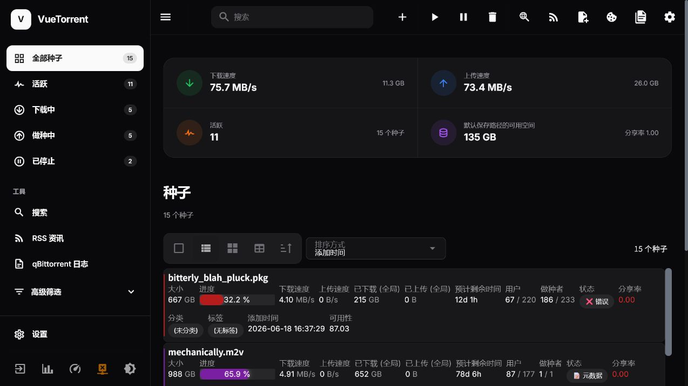

# VueTorrent Next Mod

基于 [VueTorrent](https://github.com/VueTorrent/VueTorrent) 重构的 qBittorrent 第三方网页界面，整体布局以 [Transmission Next UI](https://github.com/hisproc/transmission-next-ui)
为主要设计参考，并融入 [shadcn/ui](https://github.com/shadcn-ui/ui) 的视觉语言。

[](https://github.com/cainiao524/vuetorrent-next-mod/releases)
[](https://github.com/cainiao524/vuetorrent-next-mod/releases)
[](LICENSE)
[](https://www.qbittorrent.org/)

## 界面预览



预览中的任务和速度来自内置模拟数据，不代表真实下载活动。

## 设计特点

- 参考 Transmission Next UI 的固定侧栏、状态入口、统计卡片和信息密度。
- 使用接近 shadcn/ui 的颜色变量、边框、圆角、间距和交互状态。
- 重新设计深色与浅色主题，支持原有主题切换能力。
- 默认使用信息更完整的表格视图，并保留列表与网格视图。
- 完整保留 VueTorrent 的任务管理、搜索、订阅、日志和设置能力。
- 新增并完善简体中文导航、仪表盘和设置界面。
- 适配桌面端与窄屏设备。

## 安装

构建完成后的 WebUI 是一组静态网页文件，运行时不需要 Node.js。推荐根据使用场景选择以下两种方式。

### 方式一：使用 Nginx 独立部署

这是主项目和测试项目并行运行时的推荐方式。Nginx 同时负责提供 WebUI 静态文件和转发 qBittorrent API：

```text
浏览器
  │
  ▼
Nginx
├─ /             返回 WebUI 静态文件
└─ /api/v2/*     转发给 qBittorrent Web API
```

Nginx 不是在服务器上执行 WebUI。JavaScript、样式和字体已经包含在构建产物中，Nginx 只负责将这些文件发送给浏览器。

#### 目录结构

从[发行页面](https://github.com/cainiao524/vuetorrent-next-mod/releases)下载 `vuetorrent.zip`，解压后将 `public` 目录中的内容复制到 `webui`：

```text
vuetorrent-next-mod-deploy/
├─ docker-compose.yml
├─ nginx.conf
└─ webui/
   ├─ index.html
   ├─ assets/
   └─ 其他静态文件
```

`webui` 目录中必须直接包含 `index.html`，不能多嵌套一层 `public`。

#### Docker Compose 配置

```yaml
services:
  nginx:
    image: nginx:alpine
    container_name: vuetorrent-next-mod
    restart: unless-stopped
    ports:
      - '<WEBUI_PORT>:80'
    volumes:
      - ./webui:/usr/share/nginx/html:ro
      - ./nginx.conf:/etc/nginx/conf.d/default.conf:ro
```

将 `<WEBUI_PORT>` 替换为准备提供 WebUI 的主机端口。主项目和测试项目应使用不同的目录、容器名称和端口。

#### Nginx 配置

```nginx
server {
    listen 80;
    server_name _;

    root /usr/share/nginx/html;
    index index.html;

    location / {
        try_files $uri $uri/ /index.html;
    }

    location /api/v2/ {
        proxy_pass http://<QBITTORRENT_HOST>:<QBITTORRENT_PORT>/api/v2/;

        proxy_http_version 1.1;
        proxy_set_header Host $proxy_host;
        proxy_set_header X-Forwarded-For $proxy_add_x_forwarded_for;
        proxy_set_header X-Forwarded-Host $http_host;
        proxy_set_header X-Forwarded-Proto $scheme;

        client_max_body_size 100M;
    }
}
```

将 `<QBITTORRENT_HOST>` 和 `<QBITTORRENT_PORT>` 替换为 qBittorrent Web API 的实际地址。以上请求头与
[qBittorrent 官方 Nginx 反向代理文档](https://github.com/qbittorrent/qBittorrent/wiki/NGINX-Reverse-Proxy-for-Web-UI)保持一致。

启动和检查：

```bash
docker compose up -d
docker compose ps
docker compose logs nginx
```

更新 `nginx.conf` 后可以执行：

```bash
docker compose restart nginx
```

如果启用了 qBittorrent 的 Host 请求头验证，请同步配置允许的域名或地址。不要为了省事关闭身份验证，也不要直接通过未加密的公网 HTTP 暴露 WebUI。

### 方式二：直接导入 qBittorrent

这是最简单的部署方式，由 qBittorrent 自身同时提供 WebUI 静态文件和 `/api/v2/` 接口，不需要额外运行 Nginx。

1. 从[发行页面](https://github.com/cainiao524/vuetorrent-next-mod/releases)下载 `vuetorrent.zip`。
2. 将压缩包解压到 qBittorrent 可以读取的固定目录。
3. 打开 qBittorrent 设置中的“网页用户界面”。
4. 启用“使用替代网页用户界面”。
5. 将文件路径指向解压后的 `public` 目录，也就是直接包含 `index.html` 的目录。
6. 保存设置并刷新 qBittorrent 网页界面。

如果页面无法加载，请检查路径层级和读取权限。修改前建议保留一个可以恢复默认 WebUI 的管理入口。

更多配置说明可以参考 [qBittorrent 官方替代 WebUI 使用文档](https://github.com/qbittorrent/qBittorrent/wiki/Alternate-WebUI-usage)。

### 隐私与安全

- 分享配置或提交问题时，请隐藏真实公网地址、域名、NAS 目录、用户名、密码、Cookie 和 API 密钥。
- 内网 IP 和端口通常不能从互联网直接访问，但仍可能暴露家庭网络与服务布局，公开示例建议使用占位符。
- 如果需要从公网访问，建议使用 HTTPS、强密码、防火墙或可信 VPN。
- 不要将 `.env`、反向代理认证文件或私钥提交到仓库。

### 从源码构建

```bash
git clone https://github.com/cainiao524/vuetorrent-next-mod.git
cd vuetorrent-next-mod
npm ci
npm run build
```

构建结果位于 `vuetorrent` 目录，其中 `vuetorrent/public` 是包含 `index.html` 的静态文件目录，可按照上述任一方式部署。

## 本地开发

```bash
npm ci
npm run dev
```

复制 `.env.sample` 为 `.env` 后，可以启用模拟数据并调整本地开发参数。

常用检查命令：

```bash
npm run check-build
npm test
npm run build
```

## 主要功能

- 添加、删除、暂停、继续和重命名种子。
- 查看文件、Tracker、用户、内容、标签与分类信息。
- 管理下载顺序、速度限制和分享限制。
- 查看会话速度、传输统计、磁盘空间和分享率。
- 使用内置种子搜索、RSS 资讯和 qBittorrent 日志。
- 配置任务列表字段、卡片布局、侧栏和主题。
- 支持快捷键、批量选择和移动端布局。
- 兼容 qBittorrent Enhanced Edition 的相关设置。

## 简体中文

进入“设置 → VueTorrent → 常规设置 → 语言”，选择“简体中文”并点击保存按钮即可切换。

本项目优先复用 VueTorrent 官方语言包，仅为重构后新增的导航和仪表盘字段补充翻译。

## 与上游项目的关系

本项目是社区修改版，不是 VueTorrent、Transmission Next UI 或 shadcn/ui 的官方发行版本。

- 功能基础：[VueTorrent](https://github.com/VueTorrent/VueTorrent)
- 主要布局参考：[Transmission Next UI](https://github.com/hisproc/transmission-next-ui)
- 视觉风格参考：[shadcn/ui](https://github.com/shadcn-ui/ui)
- qBittorrent：[qBittorrent](https://github.com/qbittorrent/qBittorrent)

建议在升级 VueTorrent 上游版本前备份当前配置，并在测试环境中确认兼容性。

## 问题反馈

如果发现界面、翻译或兼容性问题，请在本仓库的[问题页面](https://github.com/cainiao524/vuetorrent-next-mod/issues)提交反馈，并附上：

- qBittorrent 版本。
- 浏览器及版本。
- 使用的主题和语言。
- 可复现步骤及截图。

## 许可证

本项目沿用 VueTorrent 的 [GNU 通用公共许可证第三版](LICENSE)。修改和分发时请继续遵守许可证要求，并保留上游项目的版权与许可证信息。
